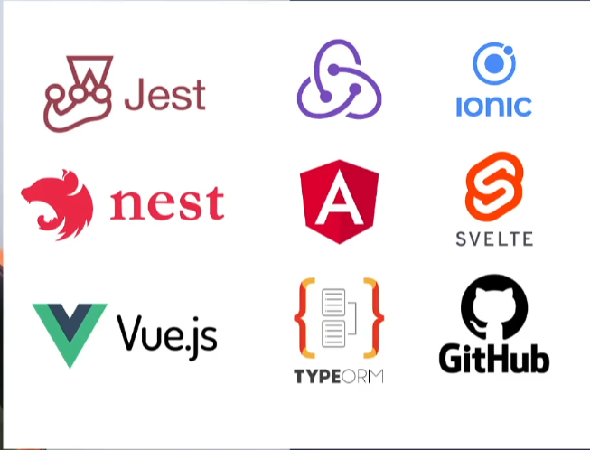
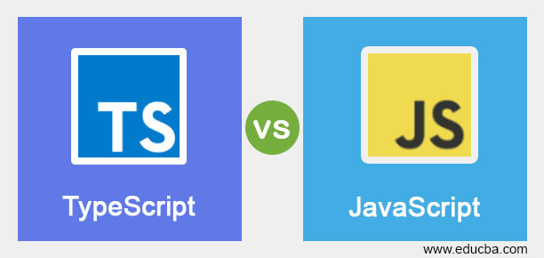
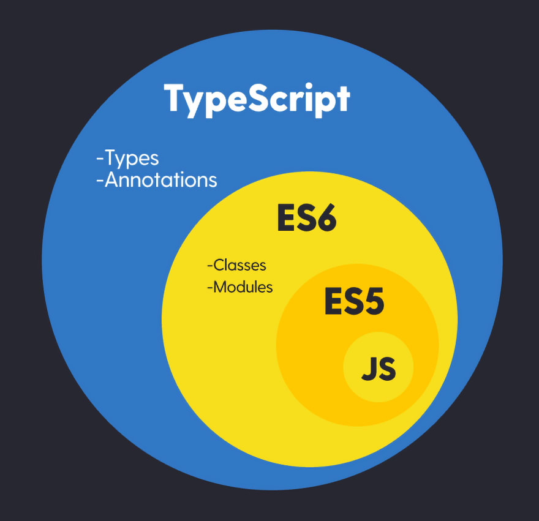
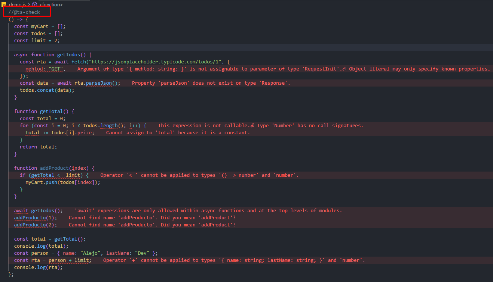
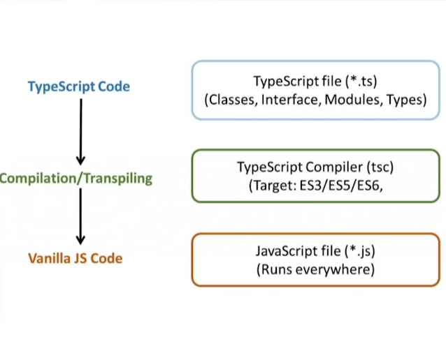
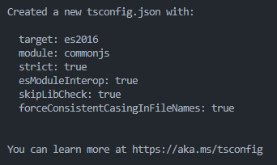
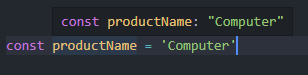

# Curso de fundamentos de Typescript

Typescript es un superset de JavaScript que agrega caracteristicas de tipado estático, clases, interfaces y otros conceptos de la Programación Orientada a Objetos (POO).

## ¿Por qué usar typescript?

1. Detecta errores en una fase temprana: A medida que se va escribiendo el código se va analizando y TS va a proporcionar un reporte con errores o mejoras que se pueden realizar.

2. Amplia la funcionalidad de javascript: TS permite utilizar funciones y conceptos de programación avanzados de manera sencilla, como clases, interfaces, enumeraciones, entre otros.

3. Proporciona una mejor experiencia de desarrollo para grandes proyectos: TS es especialmente util para proyectos grandes con muchos desarrolladores, ya que puede ayudar a mantener el código organizado y facil de entender.

   Veamos algunos datos que respaldan el uso de TS:

   - [Estaditica de descargas de TS en npm Trends](https://npmtrends.com/typescript)

   - [Top 10 de los lenguages mas usados según Github](https://octoverse.github.com/2022/top-programming-languages)

   - [Amor y odion hacia TS según stackOverflow](https://survey.stackoverflow.co/2022/#most-loved-dreaded-and-wanted-language-love-dread)

   Según un [estudio realizado por Airbnb](https://earlbarr.com/publications/typestudy.pdf) lograron prevenir en un 38% la generación de bugs gracias al uso de Typescript.

4. Integración con librerías y frameworks: Typescript es compatible con muchas librerías y frameworks de JavaScript, lo que puede facilitar la integración de estas en tus proyectos.

   

## Herramientas necesarias para continuar con el curso

- [Nodejs](https://nodejs.org/es): Se recomienda usar la versión LTS mas reciente. En caso de usar WSL, una distribución de Linux o Mac se recomienda instalar [NVM](https://github.com/nvm-sh/nvm) y descargar la versión LTS mas reciente.

- Editor de código: Se puedes usar el editor de código de tu preferencia pero se recomienda usar [visual studio code](https://code.visualstudio.com/)

- Navegador: Se puede usar cualquier navegador que soporte TS pero se recomienda [chrome](https://www.google.com/intl/es-419/chrome/)

## JavaScript vs Typescript



Veamos que cosas de deben tener en cuenta del ecosistema de JavaScript para trabajar con Typescript.

**¿Typescript es diferente de JavaScript? o un ¿Desarrollador de Typescript es diferente a un desarrollador de JavaScript?**

Lo primero que se debe tener en cuenta es que JavaScript ha tenido un uso y mejora incremental a través del tiempo, ya que no solamente se puede usar para el desarrollo Front-end y Back-end sino que tambien nos permite construir aplicaciones móviles, videojuegos, Automatización de Tareas, extensiones y complementos del navegador, Internet de las Cosas (IoT), Machine Learning, etc. En otras palabras JavaScript ha sido un lenguaje que ha madurado a traves del tiempo.

Sin embargo hasta ahora existe una desventaja al momento de usar JavaScript y es que solamente se detectan los errores cuando el código se ejecuta. Aquí es donde se destaca la principal ventaja de usar TypeScript ya que este nos proporciona un **análisis de código estático** que nos ayuda a prevenir errores antes de ejecutar el código.

También se debe tener en cuenta que mientras evoluciona JavaScript, Typescript irá a la par adoptando las nuevas características.



¿Qué es el análisis de código estático?

What I learned from Software Engineering at Google [Articulo recomendado](https://swizec.com/blog/what-i-learned-from-software-engineering-at-google/)

Según el libro **Software Engineering at Google** señalan ciertas capas para detectar errores en el desarrollo de software.

1. Análisis de código estático: Es una técnica de análisis de software que se realiza en el código fuente sin ejecutar el programa. El objetivo del análisis de código estático es identificar defectos y vulnerabilidades de seguridad en el código antes de su ejecución o implementación.

2. Pruebas Unitarias (Unit Tests): Técnica que consiste en escribir codigo automatizado encargado de validar el funcionamiento de los elementos que componen la aplicación.

3. Pruebas de Integración (Integration Tests): Técnica que consiste en probar el funcionamiento de manera colectiva de los diferentes elementos que componen la aplicación.

4. Revisión de código (Code Review): Se verifica si se ha seguido con las normas, estándares y mejores prácticas establecidas por el equipo.

En conclusión se puede decir que Typescript es diferente de JavaScript y por ende un desarrollador de Typescript también sera diferente a un desarrollador de JavaScript.

## Configuración del proyecto

1. Lo primero que debemos verificar es que tengamos instalado git, para ello usamos el siguiente comando dentro de cualquier terminal:

   ```txt
   git --version
   ```

   En caso de tener una respuesta como la siguiente significa que tenemos instalado git:

   ```txt
   git version 2.25.1
   ```

   En caso contrario, debemos instalarlo:

   - Windows sin WSL: Descargar git desde la siguiente [página](https://git-scm.com/) e instalar de forma tipica.

   - Windows con WSL, linux o Mac: Ejecutar el siguiente comando dentro de cualquier terminal:

     ```txt
     sudo apt-get install git
     ```

   Para verificar que todo quedo instalado correctamente ejecutamos el comando para verificar la versión.

2. A continuación vamos a crear la carpeta del proyecto, se recomienda crearla con el nombre "Typescript-Fundamentos" y que este ubicada en el lugar de tu preferencia.

3. Dentro de la carpeta del proyecto vamos a crear las siguientes carpetas y archivos:

   - scr (folder): Va a conteneder todo los archivos de nuestro proyectos.

   - .gitignore (file): Nos va a servir para ignorar los archivos que no queremos respaldar. Podemos crearlo accediendo a la siguiente página [gitignore.io](https://www.toptal.com/developers/gitignore). Escribimos los siguientes terminos: windows, mac, linux, node y le damos generar para obtener nuestro gitignore.

   - .editorconfig (file): Este archivo nos va a sevir para establecer unas reglas generales en el editor que tambien van a servir para que los demas miembros del equipo puedan trabajar de manera similar. El archivo va a tener el siguiente contenido:

     ```txt
       # Editor configuration, see https://editorconfig.org
       root = true

       [*]
       charset = utf-8
       indent_style = space
       indent_size = 2
       insert_final_newline = true
       trim_trailing_whitespace = true

       [*.ts]
       quote_type = single

       [*.md]
       max_line_length = off
       trim_trailing_whitespace = false
     ```

   - Package.json (file): Inicilizamos el proyecto de node usando el siguiente comando:

     ```txt
       npm init -y
     ```

     De esta manera tendremos creado el archivo package.json.

4. Instalamos TypeScript por medio del siguiente comando:

   ```txt
     npm install typescript --save-dev
   ```

   De esta manera estamos instalando Typescript a nivel de proyecto. Para verificar la versión que quedo instalada usamos el comando:

   ```txt
   npx tsc --version
   ```

## Atrapando bugs

Cabe mencionar que podemos ejecutar el analizador de codigo estatico de Typescript en un archivo de Javascript, veamos un ejemplo:

Tenemos el siguiente código:

```js
() => {
  const myCart = [];
  const todos = [];
  const limit = 2;

  async function getTodos() {
    const rta = await fetch("https://jsonplaceholder.typicode.com/todos/1", {
      mehtod: "GET",
    });
    const data = await rta.parseJson();
    todos.concat(data);
  }

  function getTotal() {
    const total = 0;
    for (const i = 0; i < todos.length(); i++) {
      total += todos[i].prize;
    }
    return total;
  }

  function addProduct(index) {
    if (getTotal <= limit) {
      myCart.push(todos[index]);
    }
  }

  await getTodos();
  addProducto(1);
  addProducto(2);

  const total = getTotal();
  console.log(total);
  const person = { name: "Alejo", lastName: "Dev" };
  const rta = person + limit;
  console.log(rta);
};
```

A simple vista no parece haber muchos errores, pero si activamos el analizador de código estático nos llevaremos una gran sorpresa. Para activarlo debemos agregar la siguiente linea al inicio del archivo.

Luego de su activación deberiamos tener algo como esto:



Como se menciono anteriormente, en JavaScript no podemos detectar los errores hasta que el código se ejecute pero gracias a TypeScript estos errores van a ser capturados al momento de escribir el código.

## Compilador de Typescript

Debemos recordar que tanto el navegador como node unicamente entienden archivos de JavaScript (.js), es por eso que debemos convertir nuestro código de TypeScript a JavaScript y a este proceso se le conoce como compilación.



Al momento de construir nuestra aplicación, todo el código será escrito en TypeScript pero cuando se vaya a ejecutar dicho código en el navegador o servidor, este deberá pasar por un proceso de transformación para convertirse a código de JavaScript. Una de las ventajas que tenemos es que podemos elegir la versión de JavaScript que necesitemos y el compilador va a convertir nuestro código de TypeScript a la versión de JavaScript que se haya elegido.

Veamos un ejemplo de compilación:

1. Dentro de la carpeta src vamos a crear un archivo llamado **hello.ts** y dentro de el vamos colocar el siguiente código:

   ```ts
   const userName = "AlejoDev95";
   console.log(userName);
   ```

2. Ejecutar el siguiente comando para compilar nuestro código a JavaScript

   ```txt
    npx tsc src/01-hello.ts
   ```

   Deberíamos tener al mismo nivel un archivo llamado _hello.js_ el cual tiene el siguiente código:

   ```js
   var userName = "AlejoDev95";
   console.log(userName);
   ```

   Aqui vemos el resultado de la compilación de nuestro código escrito en TypeScript convertido a código de JavaScript.

   Debemos tener en cuenta que por defecto se hace la compilación a JavaScript en su version ES3, pero nosotros podemos indicar cual es la versión de JavaScript objetivo, para ello ejecutamos el siguiente comando:

   ```txt
    npx tsc src/01-hello.ts --target ES6
   ```

   En el ejemplo anterior estamos compilando nuestro código de TypeScript a JavaScript en su version ES6.

   Tambien podemos indicar cual va ser la carpeta objetivo esto con el fin de ser mas organizados en nuestro proyecto. Vamos a generar un carpeta llamada **dist** la cual va a contener nuestro código de JavaScript. Ejecutamos el siguiente comando para indicar la carpeta destino:

   ```txt
   npx tsc src/**/*.ts --target es6 --outDir dist
   ```

## TSConfig.json

Para evitar el uso de los comando, podemos crear un archivo que se encarque de la configuración de nuestro proyecto, dicho archivo se llama TSConfig.json y para crearlo ejecutamos el siguiente comando:

```txt
npx tsc --init
```

Como resultado no da la siguiente información:



Ahora que ya tenemos creado el archivo tsconfig.json podemos configurar varias cosas, entre ellas la versión de JavaScript, la carpeta de entrada y salida y otras cosas que se irán viendo mas adelante.

Para ejecutar el compilador debemos ejecutar el siguiente comando:

```txt
npx tsc
```

Y de esta forma podremos compilar nuestro proyecto de una manera mas sencilla. Si deseamos dejar el compilador activo, es decir que se ejecute cada vez que guardemos nuestros cambios solamente debemos agregar el flag --watch, entonces el comando quedaría de la siguiente manera:

```txt
npx tsc --watch
```

Algo curioso a notar es que a pesar de que el compilador nos da algunos errores (Que mas adelante se iran corrigiendo), aun así se hace la compilación a JavaScript pero se aclara que esto depende de la configuración que se haga en el archivo tsconfig.json.

## ¿Qué es el tipado en Typescript?

Recordemos que en JavaScript si existen los tipos de datos pero es un lenguaje debilmente tipado, es decir que una variable puede iniciar siendo de un tipo y a lo largo de la vida del programa puede terminar siendo otro. Veamos un ejemplo:

```js
let example = null; // null
example = "Soy un string"; // string
example = 3.14; // number
example = true; // boolean
example = undefined; // undefined
example = []; // array
example = {
  // object
  name: "AlejoDev95",
  role: "Front-end",
};

// function
example = () => {
  return null;
};
```

Podemos observar como la misma variable va cambiando de tipo y esto es gracias a la flexibilidad que nos da JavaScript. Está flexibilidad no es un defecto si se sabe implementar con responsabilidad, recordemos que "Que un gran poder conlleva una gran responsabilidad".

Para crear variables en TypeScript tenemos dos formas de hacerlo:

- Explicita: Se indica de manera explicita el tipo que va a tener la variable.

  ```ts
  let example: number = 10;
  ```

- Implicita: No se indica el tipo sino que es gracias al valor que se le asigna el motor de inferencia le asigna el tipo a la variable.

  ```ts
  let example = 10; // Implicitamente obtiene el tipo number
  ```

Independientemente de la manera en que se declare una variable, esta ya tendría un tipo asignado y si se intenta asignar otro tipo de valor TypeScript no dara un error.

```ts
let myName = "AlejoDev95"; // Implicitamente string
myName = false; // Dará un error por que la variable myName solo puede guardar strings.

let age: number = 27;
age = "Mi edad es 27;"; // Dará un error por que la variable age solo puede guardar numeros.
```

De esta manera queda explicado las dos formas de crear variables en TypeScript. Ahora bien puede que nos surga la siguiente pregunta ¿Cuando es recomendable usar la forma explicita y cuando es recomendable usar la forma implicita?.

Se recominda que la forma explicita se use cuando se declara una varibale pero no se le asigna ningún valor y la forma implicita se recomienda cuando se declara una variable y se le asigna un valor. Veamos un ejemplo:

```ts
let myUserName = "AlejoDev95"; // Se usa la forma implicita cuando se declara y asigna el valor a una variable.
let myAge: number; // Se usa la forma explicita cuando se declara una variable pero no se le asigna ningún valor.
```

Independientemente de la forma en que se declare una variable y gracias a TypeScript y su tipado podemos acceder a los métodos y propiedades que cada tipo de dato nos ofrece.

```ts
let myUserName = "AlejoDev95";
let price = 10.5461231;

// Métodos que vienen los tipos strings
myUserName.length;
myUserName.slice();

// Métodos que vienen los tipos numbers
price.toFixed();
price.toExponential();
```

Al momento de trabajar con constantes no se asigna el tipo como tal y en su lugar queda el valor, veamos un ejemplo:

```ts
const productName = "Computer";
```

En primera instancia se puede pensar que el tipo de la constante **productName** es string pero su verdadero tipo es el valor que se le ha asignado y esto ocurre por qué es una constante.



En caso de trabajar solamente con TypeScript sin modulos debemos utilizar las funciones autoinvocadas (IIFE) para no tener problemas de scope entre los diferentes archivos.

```ts
(() => {
  let myName = "AlejoDev95"; // Implicitamente string
  // myName = false; // Dara un error porque la variable myName solo puede guardar strings.

  let age: number = 27;
  // age = "Mi edad es 27;"; // Dará un error por que la variable age solo puede guardar numeros.

  // Cuando usar la asignacion de tipo explicita o la implicita

  let myUserName = "AlejoDev95"; // Se usa la forma implicita cuando se declara y asigna el valor a una variable.
  let myAge: number; // Se usa la forma explicita cuando se declara una variable pero no se le asigna ningún valor.

  // Métodos y propiedades de los tipos de datos
  let price = 10.5461231;

  // Métodos que vienen los tipos strings
  myUserName.length;
  myUserName.slice();

  // Métodos que vienen los tipos numbers
  price.toFixed();
  price.toExponential();

  const productName = "Computer";
})();
```

## Numbers

Veamos un poco mas a fondo el tipo de datos number y como TypeScript nos ayuda a prevenir algunos errores.

```ts
(() => {
  let productPrice = 1500;
  productPrice = 100;

  let result = productPrice + 100;
  // Lanza un error porque solo acepta valores numericos y en este caso se le esta asignando un string.
  // result = productPrice + '100';
  console.log("result", result);
})();
```

Podemos observar que la variable **result** es de tipo number y por ende solamente va ha aceptar valores numericos y va a lanzar un error si se le asigna un valor diferente.

Veamos un ejemplo más de como el tipado nos puede ayudar a prevenir o detectar algunos errores

```ts
let productInStock: number;
console.log(productInStock); // Error
if (productInStock > 0) {
  // Error
  console.log("Send products");
} else {
  console.log("There are not products");
}
```

En el ejemplo de arriba lanzara un error por qué la variable **productInStock** no tiene asignado ningún valor. De esta manera podemos ver que gracias a TypeScript podemos darnos cuenta de diferentes errores casi al instante de haber escrito nuestro código.

Otro concepto a tener en cuenta con los tipos numericos es el concepto de **NAN (Not A Number)** el cual es un valor especial que se utiliza para indicar que un número no es un número valido. Este valor se puede obtener como resultado de algunas operaciones matemáticas, tales como dividir por cero, tratar de calcular la raiz cuadrada de un numero negativo o intentar convertir un conjunto de caracteres alfabeticos a un numero.

```ts
const input = parseInt("asdf");
console.log("input", input);
```

En el ejemplo anterior estamos intentando convertir una cadena de caracteres alfabeticos a un numero y esto da como resultado **NAN**

Se aclara la diferencia entre **Number** y **number**:

- Number: Es una clase que proporciona métodos y propiedades para trabajar con números.
- number: Es el tipo primitivo de TypeScript utilizado para numeros.

## Boleans

Las variables de tipo boolean solamente pueden ser **true** o **false**.

```ts
(() => {
  let isNew = false;
  console.log("isNew before", isNew);
  // isNew = 'true'; // Da error porque solamente acepta valores booleans (true o false)
  isNew = true;
  console.log("isNew after", isNew);
})();
```

Tambien podemos asignar un valor booleano en base a una condición:

```ts
(() => {
  const number = Math.random();
  let isNew = false;
  console.log("number", number);
  isNew = number > 0.5 ? true : false;
  console.log("isNew", isNew);
})();
```

Recordemos que se debe usar el tipo primitivo para asignar el tipo (boolean) y no la clase (Boolean).

## String

Recordemos que las cadenas de caracteres o string se pueden crear de diferentes maneras:

- Doble comilla ("")
- Comilla simple ('')
- Template strings (``);

```ts
(() => {
  // Creación de variables tipo string
  const userName = "Julian";
  const userLastname = "Sanchez";
  let userFullname = `${userName} ${userLastname}`;
  console.log(userFullname);
  // userFullname = 1234 // Error de asignación
})();
```

El uso de las diferentes formas para crear un string va a depender de la necesidad y las practicas de cada equipo. Tambien se debe recordar el usar el tipo primitivo (string) para asignar el tipo y no usar la clase (String).

## Arrays

Recordemos que los arrays son una colección de datos y en TypeScript podemos indicar que tipo o tipos puede contener un array.

- De forma inferida:

  ```ts
  // Array de numbers
  (() => {
    const listOfValues = [1, 2, 3, 4, 5];
    console.log(listOfValues);
  })();

  // Arrays de string, number y boolean
  (() => {
    const listOfValues = [1, 2, 3, true, "Value"];
    console.log(listOfValues);
  })();
  ```

  Según los valores con lo que se inicialice un array este va a inferir los tipos que pueden ser admitidos.

- De forma explicita:

  ```ts
  (() => {
    const listOfSomething: string[] = ["Name", "Coty"];
    console.log(listOfSomething);
  })();
  ```

  De esta forma estamos dicienco que el array listOfSomething solamente va ha admitir valores de tipo string.

  ```ts
  (() => {
    const listOfSomething: (string | number)[] = ["Name", 1, 2, 3, "Coty"];
    console.log(listOfSomething);
  })();
  ```

  De esta forma estamos indicando que el array listOfSomething solamente va ha aceptar valores de tipo string o number.

  ```ts
  (() => {
    const listOfTypes: (string | number | boolean)[] = [true, 1, 2, 3];
    console.log(listOfTypes);
    listOfTypes.push("Value");
    console.log(listOfTypes);
  })();
  ```

  No es necesario inicializar un array con cada uno de los valores que admite.

Algo interesante del tipado de los arrays es que cuando hacemos uso de algún método que requiera de un callback para funcionar como por ejemplo el map, el argumento que usamos ya infiere el tipo del array

```ts
(() => {
  const listOfPrice: number[] = [100, 150, 200, 300];
  const newListOfPrice = listOfPrice.map((price) => price * 0.2);
  console.log(newListOfPrice);
})();
```

De esta manera podemos trabajar con los array y restringir los tipos que este puede aceptar.

## Any

Es un tipo creado especificamente en TypeScript y nos permite aplicar la flexibilidad que tiene JavaScript. El uso de este tipo tiene un proposito y es permitir que la migración de JavaScript hacia TypeScript sea mas facil, pero se recomienda que cuando el equipo de desarrollo tenga una madures usando TypeScript no se use en tipo **any**.

```ts
let myDinamycVar: any;
myDinamycVar = 'AlejoDev95;
myDinamycVar = 123;
myDinamycVar = true;
myDinamycVar = null;
myDinamycVar = {};
```

Tambien se puede usar el valor de **any** cuando utilizamos una librería y no sabemos que tipo nos retorna o no viene tipada, pero si sabemos el tipo que nos retorna así no esta tipada entonces podemos hacer un casteo de tipos.

```ts
let myDinamycVar: any;
myDinamycVar = 'AlejoDev95';
const myString = (myDinamycVar as string).toLowerCase();

myDinamycVar = 123;
const myNumber = (<number> myDinamycVar).toFixed();
```

Recuerda que usar any debe ser la excepción y no la regla.
